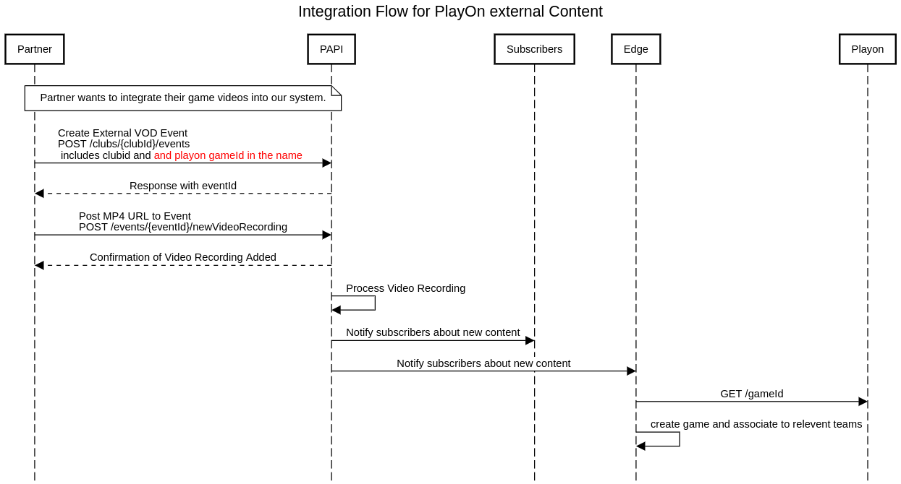

# External Content Integration

## Integration Flow Diagram



## Overview

This is a comprehensive guide to the integration flow for external content. The integration process allows partners to seamlessly incorporate their game videos into our platform through a structured API workflow.

## Prerequisites

Before beginning the integration process, partners must have an external venue set up in our system. If you don't have an external venue configured, please contact our support team to request venue creation. You will need the external venue ID for the integration flow.

## System Components

The integration involves five key components:

1. **Partner** - External organization providing game videos
2. **PAPI** - Pixellot API that serves as the central integration point
3. **Subscribers** - Internal systems that receive content notifications
4. **Edge** - Processing component that interacts with PlayOn
5. **PlayOn** - Game management system that associates content with teams

## Integration Flow

### 1. Integration Initiation
Partners looking to integrate their game videos into our system begin the process by preparing their content for submission.

### 2. Event Creation
The Partner creates an External VOD Event by sending a POST request to the PAPI endpoint:
This endpoint can also be used to add credit types and priorities at the event level. For detailed information about credit types and priorities, see the [Data API logging queue guide](data-api-logging-queue-guide.md).


**API Endpoint:**
```
POST https://api.pixellot.tv/v1/clubs/{clubId}/events
```

**Headers:**
```
Authorization: Bearer {your_api_token}
Content-Type: application/json
```

**Payload:**
```json
{
  "eventName": "EC VOD - Test Play",
  "start$date": "2024-11-01T01:00:00.000Z",
  "end$date": "2024-11-01T01:03:00.000Z",
  "status": "archived",
  "venue": {
    "_id": "{venueId}"
  },
  "breakdownDetails": {
    "type": "<basic|advanced>",
    "priority": <1|2|3>
  },
  "streamType": "vod",
  "productionType": "basketball",
  "scoreboardData": {
    "homeTeam": "Home Team",
    "awayTeam": "Guest Team",
    "enable": true
  },
  "permission": "admin"
}
```

**Important Fields:**
- `start$date` and `end$date`: Must be in the past and in ISO 8601 format (UTC)
- `status`: Must be "archived"
- `streamType`: Must be "vod"
- `breakdownDetails`: Optional object for defining credit type and priority for logging. If provided, both `type` and `priority` fields are required. 

### 3. Event Confirmation
- PAPI processes the event creation request
- PAPI responds with a unique event ID that will be used in subsequent steps

### 4. Video Upload
The Partner uploads the video content by sending a POST request to the PAPI endpoint:

**API Endpoint:**
```
POST https://api.pixellot.tv/v1/events/{eventId}/newVideoRecording
```

**Headers:**
```
Authorization: Bearer {your_api_token}
Content-Type: application/json
```

**Payload:**
```json
{
  "hd": {
    "vod": {
      "hls": {
        "videoFileUrl": "https://your-cloud-storage.com/path/to/video.mp4"
      }
    }
  }
}
```

**Important Fields:**
- `videoFileUrl`: Direct URL to your MP4 or m3u8 file

### 5. Video Processing
- PAPI internally processes the uploaded video recording
- This may include format validation, encoding, and preparation for distribution

### 6. Notification Chain
- PAPI notifies subscribers about the newly available content
- Subscribers forward this notification to the Edge component

### 7. PlayOn Integration
- Edge retrieves game information by sending a GET request to PlayOn via `/gameId`
- PlayOn creates the game entry in its system
- PlayOn associates the game with the relevant teams based on provided metadata

## Key Notes

### Authentication
Ensure your API token is valid and has the necessary permissions.

### URLs and Permissions
All URLs provided in the payloads must be publicly accessible or have appropriate permissions for our system to access them.

### Processing and Availability
After completing these steps, our system will process the events and videos, notify subscribers, and make the content available for viewing.

### Support
For any issues or further assistance, please contact our support team.


