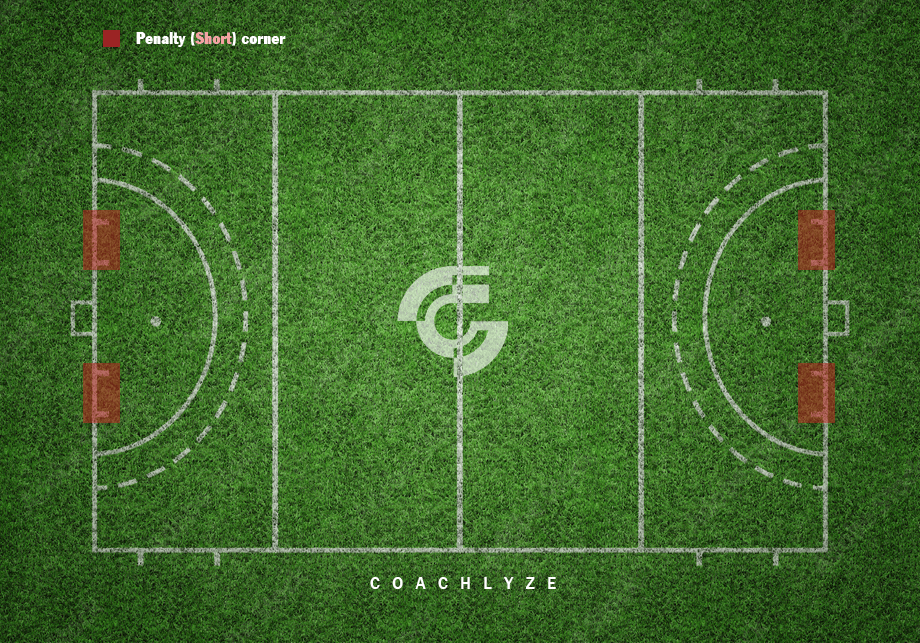
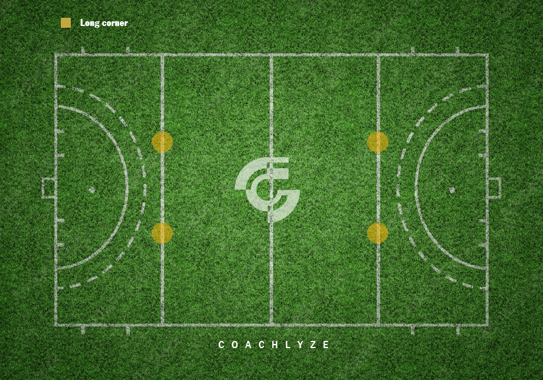
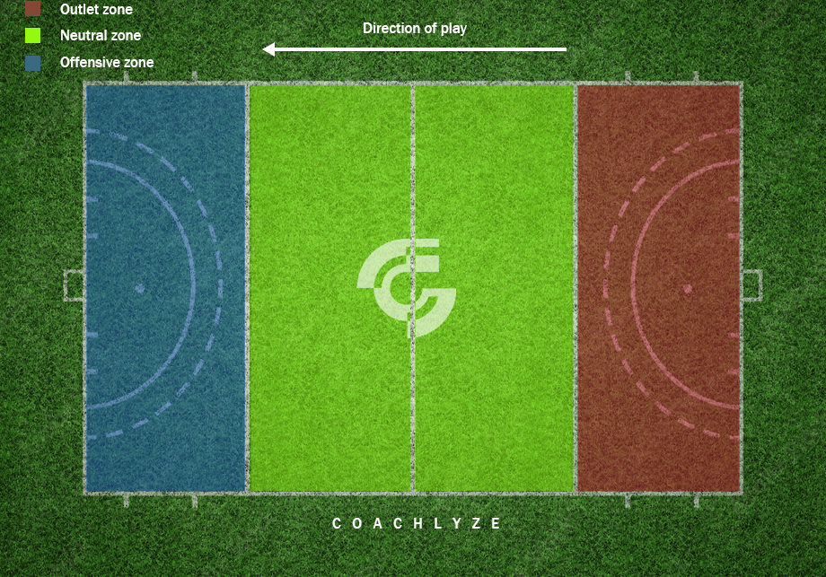
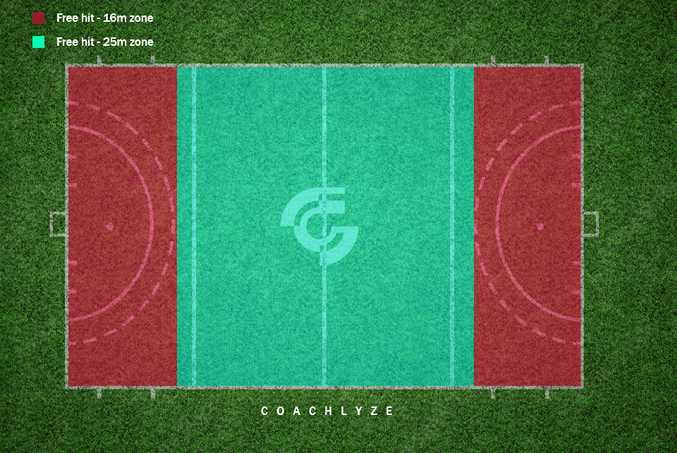
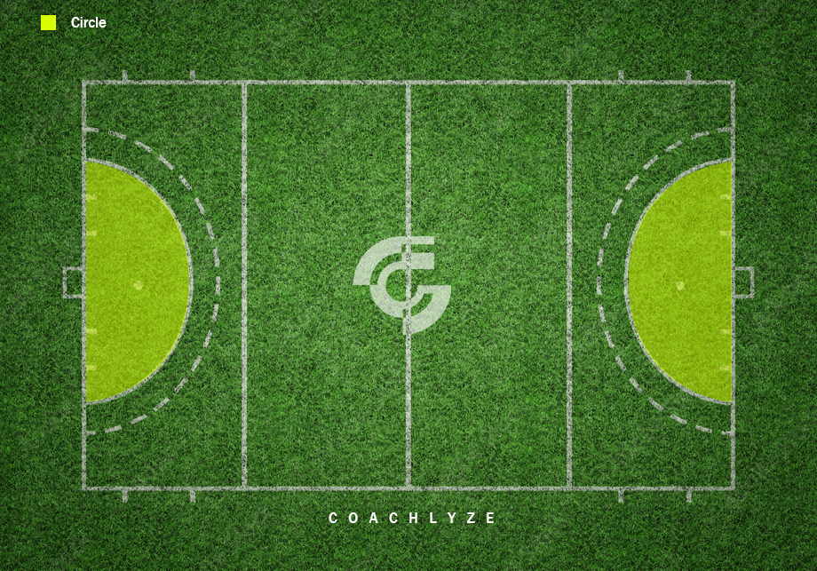

# Field Hockey Logging Instructions

## Overview

Field Hockey Basic is the standard version of field hockey that loggers can work on in the Vidswap platform.

During logging for Field Hockey Basic, the following tags are used:
- Period
- Possession  
- Offensive Zone
- Outlet
- Circle
- Penalty
- Shot
- Set Play
- Free Hit
- Penalty Corner Lead Up
- Shootout

Each of these tags is explained in detail below (the letter in parentheses indicates the keyboard shortcut):

## Logging Tags

### PERIOD (P)

Tag each quarter of the match. Start the tag a few seconds before the quarter begins and keep it active until a few seconds after it ends.

### POSSESSION (Q)

Tag the team that has possession of the ball. As in most sports, possession changes when you double-press Q, after goals, injuries, or at the end of a quarter. Clear the possession tag at those moments.

### SHOT (1)

Tag all types of shots on goal. Shot types include:

- **Goal** – when a goal is scored
- **Save** – when the goalkeeper makes a save  
- **Wide** – when the shot misses the goal
- **Block** – when the shot is blocked by a defender

### SET PLAY (W)

Tag all types of set plays during the match. Types include:

- **Center Pass** – when play starts from midfield (at the beginning of halves or after goals)
- **Penalty Hit** – a penalty stroke taken from 7 meters
- **Hit In** – when the ball is played back into play from the sideline
- **Penalty (Short) Corner** – awarded to the attacking team when the defending team commits a foul (e.g., foot, body, or hand contact) inside their own 16-meter circle

- **Long Corner** – awarded when a save or block deflects the ball out of bounds, giving the attacking team a corner

### PENALTY (F)

Tag when a team commits a foul. Select the team that committed the foul. Common fouls include:

- Playing the ball with the foot or body
- Using the wrong side of the stick
- Pushing, holding, or other physical contact
- Dangerous play (e.g., high stick, playing the ball too close to another player)
- Obstructing an opponent with the body
- Not keeping the required 5-meter distance on a free hit

### OFFENSIVE ZONE (A)

Tag when the ball enters the final 25 meters of the field. It does not matter which team has possession — once the ball enters this zone, the tag is active. Turn off the tag once the ball exits the 25-meter area.

### OUTLET (D)

Tag when the defending team gains possession in their 25-meter defensive zone and begins an attempt to move the ball past midfield. The outlet ends if the team loses possession or crosses midfield.

Outlets can start from:
- A turnover
- A hit in
- A free hit within the defensive zone

### FREE HIT (H)

Tag a free hit, awarded for a minor foul that does not warrant a penalty corner or penalty stroke. Free hits are taken from the location of the foul unless it occurs within the defensive circle.

Free hits can be:
- **Passed** to another player
- **Self-started** (the player dribbles the ball themselves)

#### Free Hit Types:
- **16m Free Hit**
- **25m Free Hit**

Also tag whether it was **Successful** (team retained possession) or **Unsuccessful** (team lost possession).

### CIRCLE (R)

Tag when the ball enters the 16-meter circle and the attacking team is in possession. End the tag when:
- The ball exits the circle
- The attacking team loses possession within the circle

### PENALTY CORNER LEAD UP (L)

Tag the reason a penalty corner was awarded. This is used when the referee calls a penalty corner due to a defensive foul inside the attacking circle (16 meters). Tag the defensive team that committed the foul.

### SHOOTOUT

Tag only when penalty shootouts occur at the end of the match.

For each attempt:
- Tag **Successful** if the goal is scored
- Tag **Unsuccessful** if the attempt fails
- Also, tag the player taking the shot

Additionally, use the Shot tag to classify the outcome:
- Goal
- Save  
- Wide
