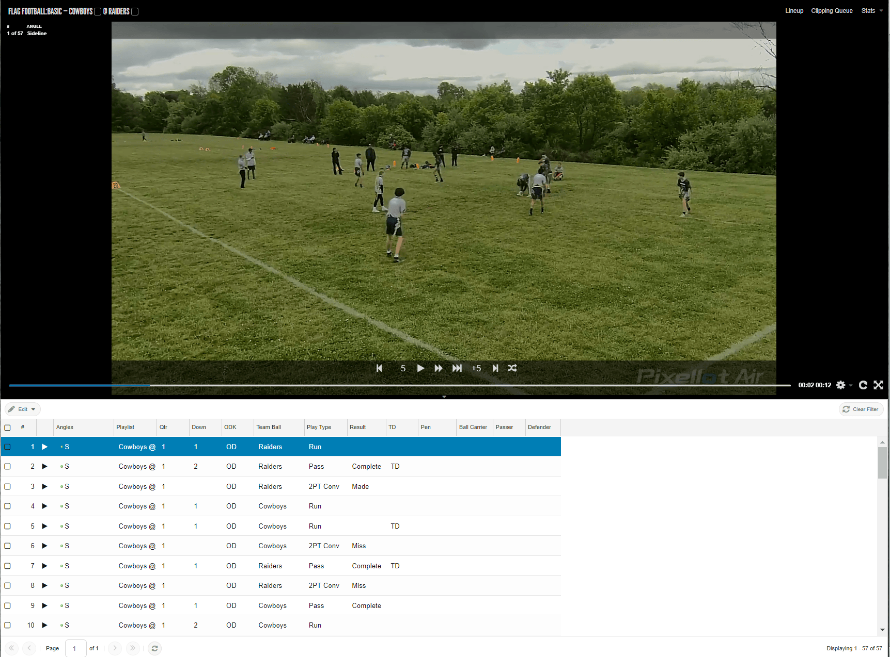

# Flag Football Logging Instructions

## Overview

Flag Football Basic is the standard version of flag football that loggers can work on in the Vidswap platform.

Flag football is played in 5v5, 6v6, 7v7, or 9v9 formats, depending on the region and age group. To accommodate fewer players, the field size is 30 yards wide and 70 yards long, with two 10-yard end zones.

During logging for Flag Football Basic, the following tags are used:
- QTR (Quarter)
- ODK (OD/K)
- Team Ball (team in possession)

Each of these tags is explained in detail below (the letter in parentheses indicates the keyboard shortcut):

## General Rules for Flag Football

- All passes must be forward and caught BEYOND the line of scrimmage (SCREEN PASSES are NOT allowed).
- Only direct handoffs are allowed — lateral (screen) passes are NOT permitted anywhere on the field.
- The quarterback has 7 seconds to release the ball. The QB is NOT allowed to run with the ball unless it was handed off to them first via a direct handoff.
- Interceptions may be returned, including on extra point attempts (1PT CONV and 2PT CONV).
- All offensive penalties result in a loss of down and loss of yardage.
- All defensive penalties result in an automatic first down, and some may also include an additional gain of yardage.

## Scoring System

Scoring in flag football is as follows:
- **Touchdown (TD)** = 6 points
- **Safety** = 2 points
- **1-Point Conversion (1PT CONV)** = 1 point
- **2-Point Conversion (2PT CONV)** = 2 points

## Field and Format

The team starting from its own side has 4 downs to reach midfield. After crossing midfield, the team has 3 additional downs to score a touchdown.

## Fumbles Rule

Fumbles do NOT exist in flag football, except in the case of a muffed kickoff, where the receiving team drops the ball and the kicking team is allowed to recover it (fumble situation).

In regular gameplay, if a player drops the ball during a run or pass play, the play is ruled dead at the spot of the drop (DEAD BALL), and possession remains with the team that dropped it.

## Differences in Logging Flag Football vs Outdoor Football

- Do NOT record yardage (YD BEG, YD END, Dist, Gain) for flag football.
- Also, do NOT use FORM or the Field Goal (FG) option.
- Stats-Result calculation is currently disabled for flag football due to major rule differences.
- Therefore, always enter the final score as 0:0 when uploading the game.

## Example Timeline and Logging for Flag Football

## Logging Tags

### QTR (Quarter)

Tag each quarter of the match. Start the tag a few seconds before the quarter begins and keep it active until a few seconds after it ends.

### ODK (OD/K)

Tag the offensive/defensive/kicking situation during play.

### Team Ball

Tag the team that has possession of the ball. Possession changes during turnovers, after scores, injuries, or at the end of a quarter.

## Flag Football ODK Logging

Log only the same three tags as in Outdoor ODK:
- **QTR (Quarter)**
- **ODK (OD/K)** 
- **Team Ball** (team in possession)

All other fields must remain empty.

## Special Situations

### NO PLAY Tag

If you receive a pre-clipped game where a clip includes footage of the scoreboard, warmups, referees, or any other non-game action, tag that clip with "NO PLAY".

When using the NO PLAY tag on ODK, all other tags must remain blank, including QTR, DOWN, and Team Ball.

The only field that should be filled is Play Type – No Play. 
