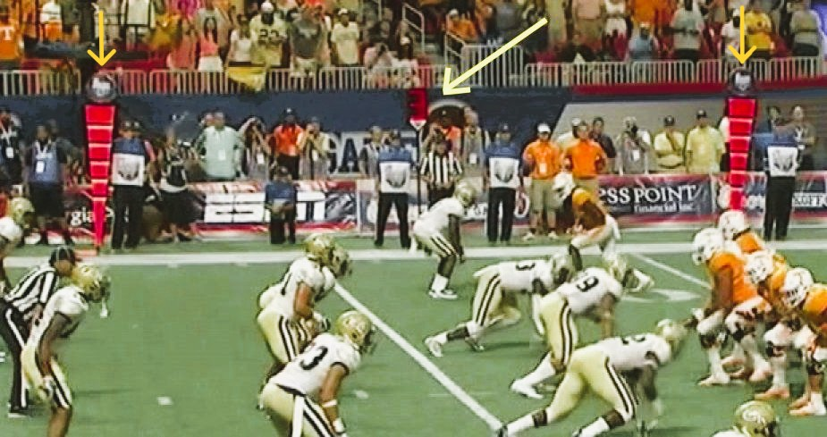
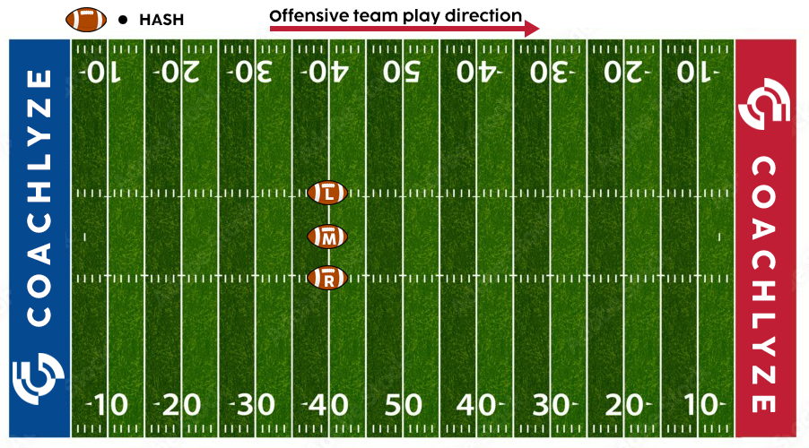
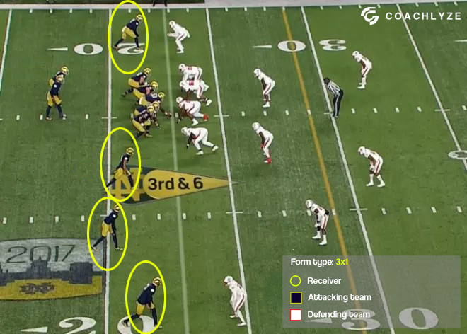
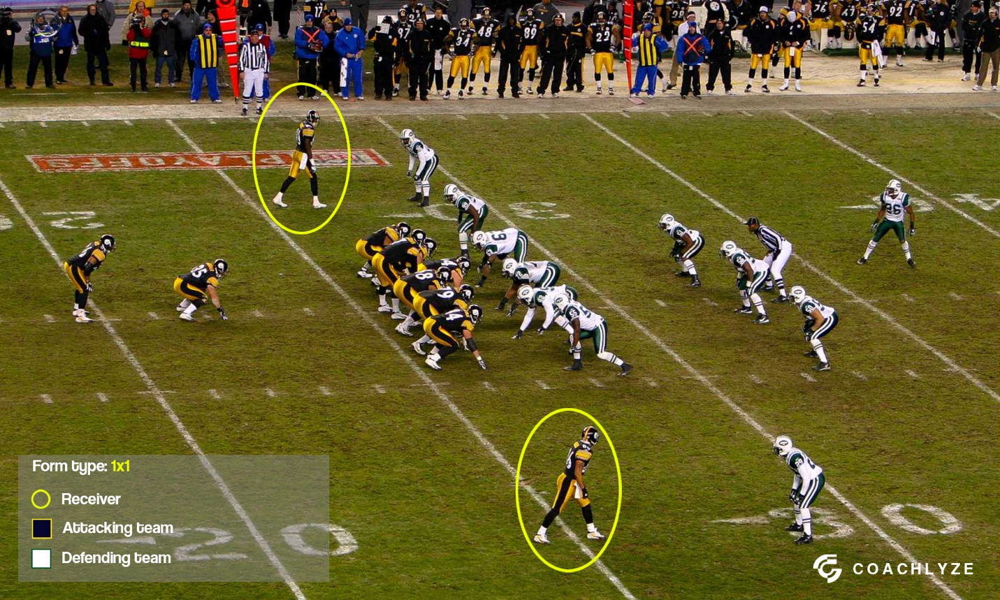
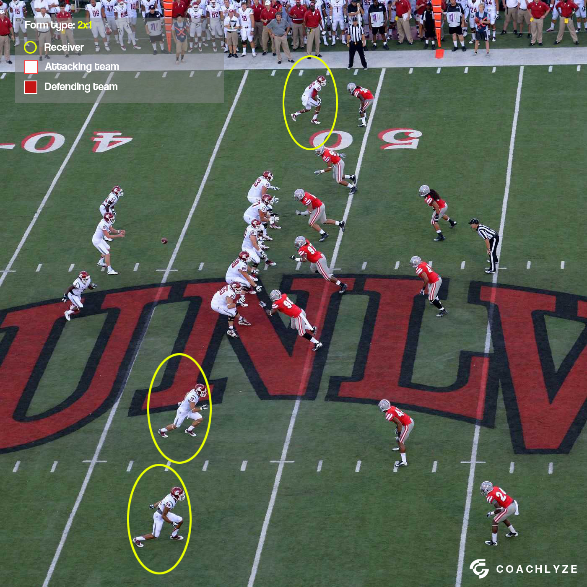

# Outdoor Football Logging Instructions

## Overview

Outdoor Football Basic is the standard version of outdoor football that loggers can work on in the Vidswap platform.

During logging for Outdoor Football Basic, the following tags are used:
- Qtr (Quarter)
- ODK (Offense/Defense/Kicking)
- Team Ball (Team in possession)
- Dwn (Down)
- Dist (Distance)
- Yd Beg (Yard Begin)
- Hash (Hash mark position)
- Form (Receiver formation)
- Play Type
- Yd End (Yard End)
- Gain
- Result

Each of these tags is explained in detail below:

## Logging Tags

### QTR (Quarter)

**Qtr** – The quarter in which the game is being played (1, 2, 3, 4, or OT)

### ODK (Offense/Defense/Kicking)

**ODK** – Automatically filled when the Play Type is entered. The options are OD (offense vs. defense) or K (kicking plays, such as FG, KO, Punt, PAT)

### TEAM BALL (Team in Possession)

**Team Ball** – The team with possession of the ball (the offense)

### DWN (Down)

**Dwn** – The down number of the team with the ball (1, 2, 3, or 4)

### DIST (Distance)

**Dist** – The number of yards the offensive team needs to gain for a new first down. The first attempt is always for 10 yards unless the offensive team starts within the opponent's 10 yards (e.g., starting from the -4-yard line, so Dist would be 4 yards)

There are referees positioned on the sidelines holding large orange markers, one to mark the starting yard and the other to show the yardage required to gain a new first down (and four new attempts)

### YD BEG (Yard Begin)

**Yd Beg** – The yardage from which the offensive team starts the play

### HASH (Hash Mark Position)

**Hash** – The position of the ball on the field: L (left), M (middle), or R (right). A couple of yards around the center and the center itself are marked as M, and the rest are either L or R. This is observed from the perspective of the offense

### FORM (Receiver Formation)

**Form** – Refers to the number of receivers on the offensive team. Receivers stand on the left and right side of the offense, separated from the offensive line, quarterback, and running back.

Example: 2x2 - Two receivers on the left, two on the right, 3x1 - One receiver on the left, three on the right (or vice versa). Form is recorded at the moment when the team starts their offensive play

Example of form 3x1:

Example of form 1x1:

Example of form 2x1:

## Play Types

### PLAY TYPE

**Play Type** – Records the type of action that was played. The options are:

- **Pass** – The quarterback throws a pass to a receiver
- **Screen** – The quarterback passes the ball to a receiver behind the line of scrimmage
- **Run** – The quarterback hands the ball to a teammate who runs with it or runs himself
- **PAT** – A one-point kick attempt after a touchdown
- **2PT** – A two-point conversion attempt after a touchdown
- **FG** – A field goal attempt for three points (usually on fourth down or at the end of a half/game)
- **KO** – Kickoff to start the first and second halves or after scoring
- **Punt** – A kick from the hand (punting) usually on fourth down
- **No play** – When there is no play (e.g., timeout, penalty, or other situations)

### YD END (Yard End)

**Yd End** – Records the yardage at the end of the play. When the offense crosses into the opponent's half of the field, minus yards are recorded (e.g., starting from the 49-yard line and gaining 5 yards, Yd End will show -46, and Yd Beg will automatically show -46 for the next clip)

### GAIN

**Gain** – Records how many yards the team gained or lost during the play (the software fills this automatically when Yd End is entered, except for TDs and Safeties, which must be manually entered)

## Results

### RESULT

**Result** – This column is filled based on the action type and the result of that action. Possible results:

- **Complete** – When the receiver catches the ball from the quarterback (in the case of pass or screen)
- **Incomplete** – When the quarterback's pass is not caught or goes out of bounds
- **Fumble (kept)** – When a player drops the ball but the offensive team retains possession
- **Fumble (lost)** – When a player fumbles the ball and the defense recovers it
- **INT (Interception)** – When the defense intercepts the quarterback's pass
- **Made** – When the team completes a kick (FG, PAT) or two-point conversion
- **Miss** – When the team misses a kick (FG, PAT) or two-point conversion attempt
- **Sack** – When the quarterback is tackled behind the line of scrimmage before releasing the ball
- **Safety** – When the defense tackles an offensive player in their own end zone (usually the quarterback)
- **TD (Touchdown)** – When the offense scores by entering the opponent's end zone

## Player Tagging

### Tagging Players:

- **Ball Carrier** – The player running with the ball (whether running or after a completed pass)
- **Passer** – The player who throws the pass
- **Defender** – The defender who tackles or intercepts the ball
- **Defender2** – The second player involved in a tackle, especially in joint tackles
- **Kicker** – The player executing kickoffs, field goals, PATs, or punts

Player tagging is not done in the following situations:
- When there is no play (timeouts, scoreboard checks, game breaks), no play + penalty, or the 2PT option
- When penalties are associated with KO, Punt, PAT, or 2PT

## Penalty Logging

### NO PLAY + PENALTY

**No Play + Penalty** – Recorded when there is a loss of yards due to a penalty or when the team progresses for 5, 10, or 15 yards as a result of a penalty. The penalty is always recorded, and the corresponding play is logged as "No Play"

**No Play + Penalty** is also recorded when the team gains yardage as a result of a penalty (e.g., +5, +10, +15 yards)

When there is a +Gain, meaning the team with possession advances by +2, +7, +17, +24, +33 yards, etc., we ALWAYS log the PLAY TYPE (PASS, RUN, SCREEN) + PENALTY

### Specific situations for PUNT, KO, PAT, 2PT:

For PUNT, KO, PAT, and 2PT plays, we log the Play Type options (Punt, KO, PAT, 2PT) + Penalty if a foul occurs

In these clips, we log, for example, PAT + Penalty or PUNT + Penalty. We do NOT log the YD End, and in the Result, we do NOT log Miss/Made. The kicker does not need to be tagged in this case, as the penalty nullifies the play

## Scoring

### Field Goals Made
- Play Type=FG and Result=Made award 3 points to the team on "Team Ball" Column

### Offensive Touchdown
- TD is "TD", Play Type="Pass,Run,Screen" and Result is not "Fumble(lost) or Int", the "Team Ball" team is awarded 6 points

### PAT and 2PT Conversion
- Play Type="PAT or 2PT" and Result="made", the "Team Ball" Team is awarded 1 point for PAT and 2 points for 2PT

### FG and KO Returns
- Play Type"FG or KO" and TD is "TD", 6 points are awarded to the opponent team of the team in "Team Ball"

### Safeties
- Result is "Safety", 2 points are awarded to the opponent team of the team in "Team Ball" Column

### Interception and Fumble Return TDs
- Result="Fumble (lost) or Int" and TD="TD", 6 points are awarded to the opponent team of the team in "Team Ball" Column 
