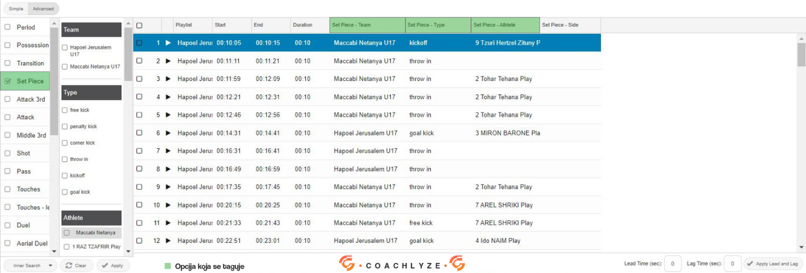

# Soccer Logging Instructions

## Overview

Soccer Basic is a foundational variation of soccer that loggers can log on Vidswap. In addition to Soccer Basic, there are also Medium, Advanced, and Pro Soccer variations. Loggers can learn more about these in another tutorial, which they can access after gaining a certain level of knowledge and experience using Vidswap.

During logging for Soccer Basic, the following tags are used:
- Period
- Possession
- Transition
- Set Piece
- Attack 3rd
- Shot
- Foul
- Offside
- Duel

Each of these tags is explained in detail below (the letter in parentheses indicates the keyboard shortcut):

## Logging Tags

### PERIOD (P)

This tag covers entire halves (1st and 2nd) or overtime (OT). With this tag, the logger marks which half or OT is currently in progress. Period-Time option is not logged for Soccer Basic.

Example of a completed period in the filter:

### POSSESSION (Q)

The possession tag allows the logger to mark which team possesses the ball. Pressing Q twice will automatically switch the possession to the other team.

#### When possession ends:
Possession is stopped in the following situations:
- At halftime
- After goals
- After injuries (when a medic enters to assist a player)
- During hydration breaks

#### Changing possession:
Possession changes only when the other team gains complete control of the ball (achieving at least one accurate pass or a player holding control for at least 2-3 seconds). Additionally, possession changes immediately after the ball goes out of play, after a shot, a foul, or a throw-in.

#### Possession Sequence in Filters:
In the filter, team possessions typically alternate, except in the following cases:
- End of the first half and start of the second, when the same team had possession last and starts with the kick-off
- After an injury, when the referee returns the ball to the same team

**Options Not Logged:** Possession - Strings and Possession - Qualifier are not logged for Soccer Basic

Example of a completed possession in the filter:

### TRANSITION

The program automatically creates transitions when the logger switches possession. Transitions always appear between two possessions.

#### Deleting Extra Transitions:
The logger is responsible for deleting unnecessary transitions, which occur in the following situations:
- At the start of each half and overtime
- After goals
- After injuries
- After hydration breaks

Example of a Completed Transition on the Timeline:

### SET PIECE (W)

This tag is used by loggers to mark which team and player are executing a type of set piece: free kick, penalty kick, corner kick, throw-in, kickoff, or goal kick. Loggers will tag the options for team, type, and athlete, but the side option is not used.

#### Activation and Timing:
The tag is activated at the moment the set piece is executed. The program is designed to capture 5 seconds before and 5 seconds after the moment the set piece tag is activated.

#### Recording Shots:
If there is a direct shot on goal from a free kick or corner kick, loggers should simultaneously record both the Free Kick + Shot or Corner Kick + Shot

Example of a completed set piece in the filter:

### ATTACK 3RD (A)

This tag is recorded when the ball is in the attacking third of the field (the last 30 meters), regardless of which team has possession of the ball.

It is mandatory to log during corner kicks, goal kicks, shots, passes between center-backs, passes from a teammate to the goalkeeper, and when the ball enters the attacking third (the last 30 meters).

### SHOT (1)

This tag is recorded for every shot taken during the match. The details logged include:
- **Team:** The team that took the shot
- **Result:** The type of shot outcome (goal, save, wide, blocked)
- **Own Goal:** Marked if the shot results in an own goal
- **Athlete:** The player who took the shot
- **Assist:** The player who assisted (only if there is an assist on a goal shot)
- **Goalkeeper:** Tagged for the goalkeeper only on Save/Goal shots
- **Block Athlete:** The player who blocked the shot (only for blocked shots)

**Net Location:** Marked to indicate where the ball ended up after shots (Goal/Save/Wide)

**Field Location:** This is tagged to indicate the location on the field from where the shot was taken (applies to all types of shots)

Tags that are not logged include: body location, 2nd assist, and 3rd assist

#### Shot Types:
- **Shot - Goal**
- **Shot - Save**
- **Shot - Blocked**
- **Shot - Wide**
- **Shot - Own Goal**

Example of a Completed Shot in the Filter:

### DUEL (D)

This tag is used to record aerial duels, whether 1vs1, 1vs2, or 1vs3, both in the air or on the ground, specifically when the ball is headed. An aerial duel is won by the team whose player makes contact with the ball using their head, regardless of which team gains possession afterward. If an aerial duel leads to an attacker heading the ball towards the goal, both the shot and duel-aerial should be logged.

#### Tags to Log:
- **Won By:** The team that won the aerial duel
- **Duel Type:** Marked as "Aerial" to specify the duel type

**Tags Not Logged:** Do not log lost by, result, duel won, duel lost, attacking athlete, or defending athlete

Example of a Completed Duel in the Filter:

### FOUL - LEGACY (F)

This tag is used to mark when a foul is committed, including situations where a foul occurs and the referee allows an advantage to play on. Fouls also include handballs and cases where the referee awards an indirect free kick.

#### Tags to Log:
- **Team:** The team that committed the foul
- **Athlete:** The player who committed the foul
- **Card:** Marked if the player receives a yellow or red card
- **Advantage:** Marked if the referee plays an advantage

**Tags Not Logged:** Do not log on and type

Example of a Completed Foul in the Filter:

### OFFSIDE

This tag is used to record when the referee calls an offside. Only the team that has been penalized for offside is logged.

It is important to note that if the assistant referee signals for offside but the main referee allows play to continue (playing an advantage) and no free kick is awarded, the offside should not be logged in those situations.

Example of a Completed Offside in the Filter: 
