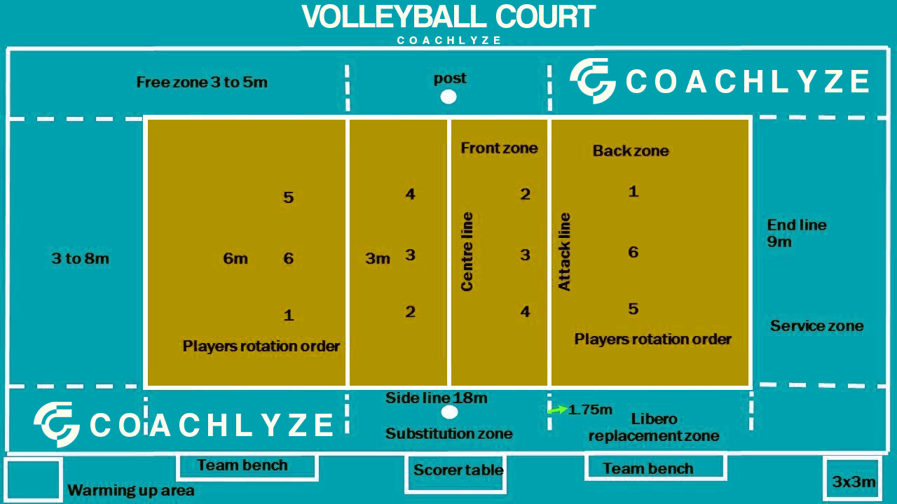
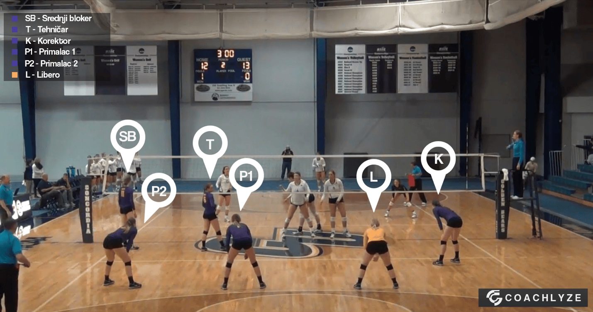
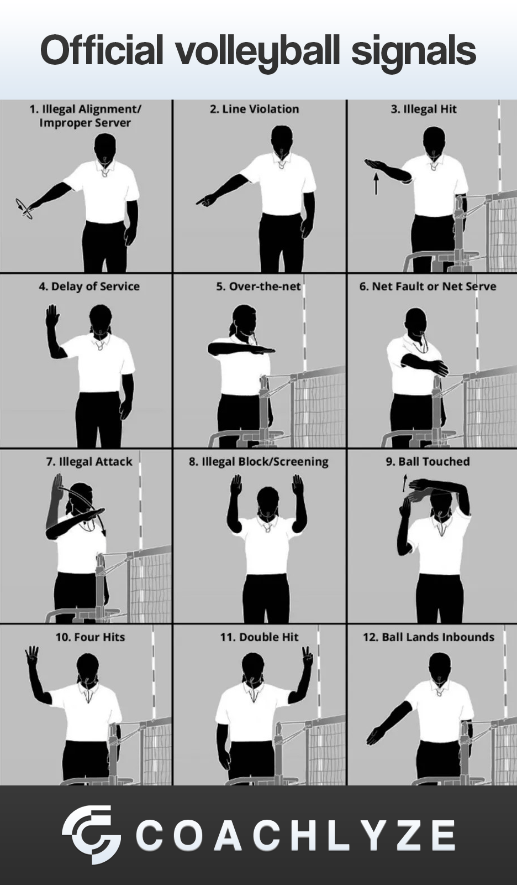
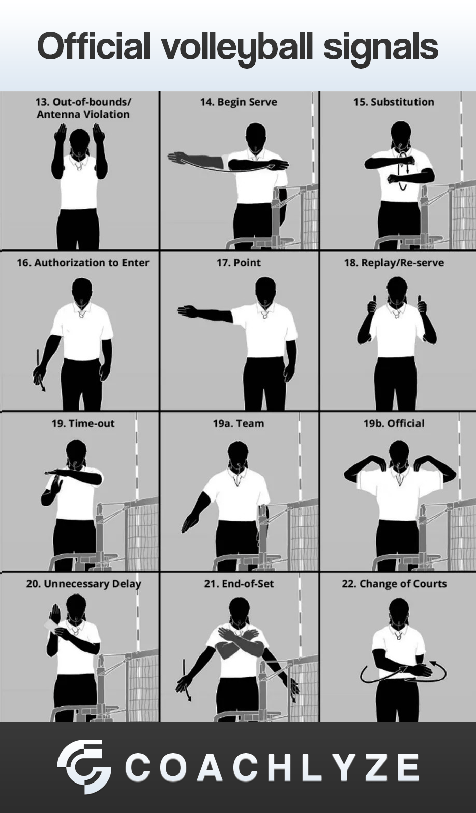

# Volleyball Logging Instructions

## Overview

Volleyball Basic is the standard version of volleyball that loggers can work on in the Vidswap platform.

## Volleyball Basics

The volleyball court measures 18 x 9 meters and is divided in half by a net.

The net height is 2.43 meters for men and 2.24 meters for women.

Each team has six players on the court (three in the front row and three in the back row).

Players rotate clockwise each time their team wins the serve.

This rotation ensures that every player serves and experiences all court positions.

A team is allowed three touches to return the ball over the net (a block does not count as one of the three touches).

## Rules

A match is played as a best-of-five sets.

On Vidswap, depending on age group, league, and competition rules, matches may be played as best-of-three or best-of-one.

Standard sets are played to 25 points, but a team must win by at least two points.

Again, depending on the level, sets may be played to 21 or 15 points on Vidswap.

The fifth set (or third set, in shorter formats) is played to 15 points, also requiring a two-point lead to win.

## Objective of the Game

The goal in volleyball is to win points by sending the ball legally over the net into the opponent's court, or by forcing the opposing team to commit an error.

The team that first reaches the required number of points (usually 25) with at least a two-point lead wins the set.

Players are not allowed to touch the net or cross over to the opponent's side of the court.

## Positions

**Opposite Hitter (Right-side Hitter):** Positioned in the front row, often responsible for finishing attacks. This player usually takes the majority of the team's offensive swings.

**Setter:** Orchestrates the offense and handles most second contacts. The setter's role is to deliver accurate sets to attackers.

**Middle Blocker:** Specializes in blocking opponents' attacks and attacking quickly through the middle of the court.

**Outside Hitter (Outside Receiver):** Specializes in receiving serves and handling the first contact. Also plays a key role in attacking and blocking from the front row.

**Libero:** A specialized defensive player who can substitute freely without formal substitution procedures. The libero cannot attack or block and wears a different-colored jersey.

## Common Faults

**Ball not over the net / out of bounds:** The ball doesn't cross the net or lands outside the boundaries.

**Double Contact:** A player touches the ball twice in a row (except after a block).

**Lift / Carry:** The ball is held, scooped, or not hit cleanly.

**Net Touch:** A player touches the net while the ball is in play.

**Rotation Fault:** A team is not in the correct rotation order when the server contacts the ball.

## Basic Actions

**Serve:** The action that starts a rally. The server must send the ball over the net into the opponent's court. If the receiving team fails to return the ball properly, the serving team earns a point.

**Pass (Reception):** The first contact after a serve. The goal is to control the ball and direct it to the setter. This is usually performed by the outside hitter or libero.

**Set:** The second contact. The setter delivers the ball to an attacker, aiming to create an optimal opportunity for a successful attack.

**Attack (Spike):** The third contact, intended to hit the ball forcefully over the net to score a point. The spike is the most powerful and efficient offensive move.

**Block:** A defensive action at the net to stop or deflect an opponent's attack. The objective is to prevent the ball from crossing or redirect it for a counterattack.

**Defense (Dig):** If the block is not successful or the opponent uses a different type of shot, the back-row players—especially the libero—attempt to receive the ball and keep the play alive. The goal is to control the ball and transition back to offense.

## Volleyball Logging

One of the most important elements in volleyball logging is watching the referees. Volleyball is a sport where referee signals are crucial to properly log each action. There is one main referee, one assistant referee, and one line judge on each side of the court.

Below are two example images of official referee hand signals.

In the following section, each logging tag is explained in detail (the letter in parentheses represents the keyboard shortcut):

## Logging Tags

### MATCH (P)

This tag is used to mark which set is currently being played (Set 1, 2, 3, 4, or 5).

Use this tag to track the active set.

### RALLY (Q)

This tag is applied 2–3 seconds before the serve and turned off 2–3 seconds after the point ends.

It should cover the entire sequence of play.

Within this tag, you must log:
- **Won By** – the team that won the rally
- **Serving** – the team that served the ball

Do not use the tags Serve rotation or Rec rotation.

### SERVE (W)

Log every serve in the match.

Tags to be filled in:
- **Team** – the team serving
- **Result** – (e.g., Ace, Error, In Play)
- **Serving Athlete** – if available
- **Grade** – based on reception difficulty
- **Path** – draw the trajectory of the serve

### PASS (D)

Log the first contact after a serve or after an opponent's attack.

When you start the Pass tag, Set and Attack tags will activate automatically — cancel them if they don't apply to the situation.

Tags to be filled in:
- **Team** – the team receiving the ball
- **Result** – Dig, Reception, or Reception Error
- **Athlete** – the player making the pass
- **Grade** – based on pass quality

Do not use the Error result under the Pass tag.

### SET (S)

This tag is usually applied on the second contact after a serve or attack, but may occasionally be used on the first contact in special situations.

Tags to be filled in:
- **Team**
- **Result** – Assist or Error
- **Athlete**

Do not use the Path (drawing) option here.

### ATTACK (A)

Typically used on the third contact, though in certain situations it may be used on the second or even first contact.

Tags to be filled in:
- **Team**
- **Result** – Kill or Error
- **Athlete**
- **Path** – only used for Kill results (draw the attack trajectory)

### BLOCK (1)

Tag a block only when it directly results in a point or an error (net violation or reaching over).

Do not tag a block if the rally continues after the ball hits the block.

Tags to be filled in:
- **Team**
- **Result** – Solo, Assist, or Error
- **Athlete**

### FREEBALL (F)

This tag is used when a team sends the ball over the net with no intention to attack (typically using an overhead bump/pass to keep the play alive).

Tags to be filled in:
- **Team**
- **Athlete**

## Service & Reception Grading

Service grades are directly influenced by the quality of the reception. Grades range from 0 to 5.

| Reception Grade | Description | Corresponding Serve Grade |
|----------------|-------------|---------------------------|
| 3 | Perfect reception (ideal for the setter) | 1 |
| 2 | Setter needs to take a few steps to the ball | 2 |
| 1 | Setter must run to the ball inside the 3m zone or outside it, non-setter sets, bump set | 3 |
| 0 (Freeball) | Receiver passes ball directly over as a freeball | 4 |
| 0 (Reception Error) | Serve results in a direct ace (Reception Error) | 5 |
| Serve Error | Ball hits net or goes out – no reception attempted | 0 | 
