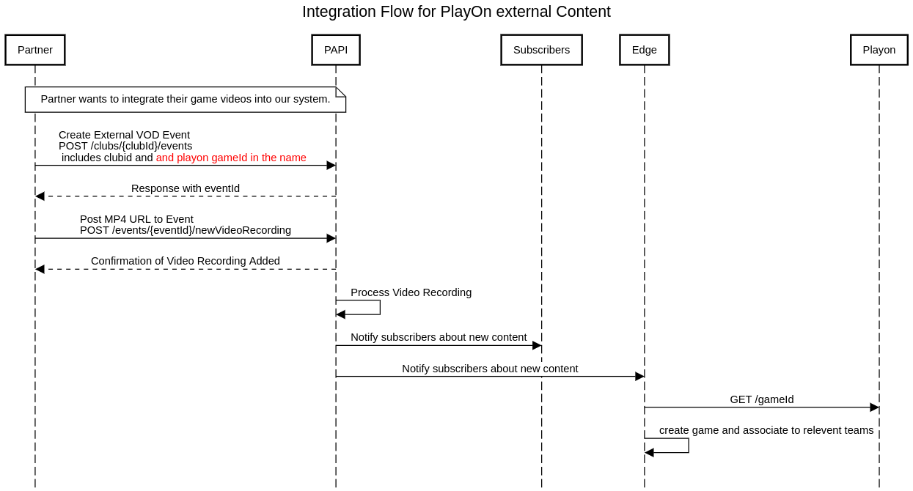

# PlayOn External Content Integration

## Integration Flow Diagram

## Overview

This README provides a comprehensive guide to the integration flow for external content in the PlayOn system. The integration process allows partners to seamlessly incorporate their game videos into our platform through a structured API workflow.

## System Components

The integration involves five key components:

1. **Partner** - External organization providing game videos
2. **PAPI** - Pixellot API that serves as the central integration point
3. **Subscribers** - Internal systems that receive content notifications
4. **Edge** - Processing component that interacts with PlayOn
5. **PlayOn** - Game management system that associates content with teams

## Integration Flow

### 1. Integration Initiation
Partners looking to integrate their game videos into our system begin the process by preparing their content for submission.

### 2. Event Creation
The Partner creates an External VOD Event by:
- Sending a POST request to `/clubs/{clubId}/events`
- Including the club ID and PlayOn game ID in the name field
- Submitting the request to PAPI

### 3. Event Confirmation
- PAPI processes the event creation request
- PAPI responds with a unique event ID that will be used in subsequent steps

### 4. Video Upload
- The Partner uploads the video content by sending a POST request to `/events/{eventId}/newVideoRecording`
- This request includes the MP4 URL for the game video
- PAPI confirms that the video recording has been successfully added

### 5. Video Processing
- PAPI internally processes the uploaded video recording
- This may include format validation, encoding, and preparation for distribution

### 6. Notification Chain
- PAPI notifies subscribers about the newly available content
- Subscribers forward this notification to the Edge component

### 7. PlayOn Integration
- Edge retrieves game information by sending a GET request to PlayOn via `/gameId`
- PlayOn creates the game entry in its system
- PlayOn associates the game with the relevant teams based on provided metadata

