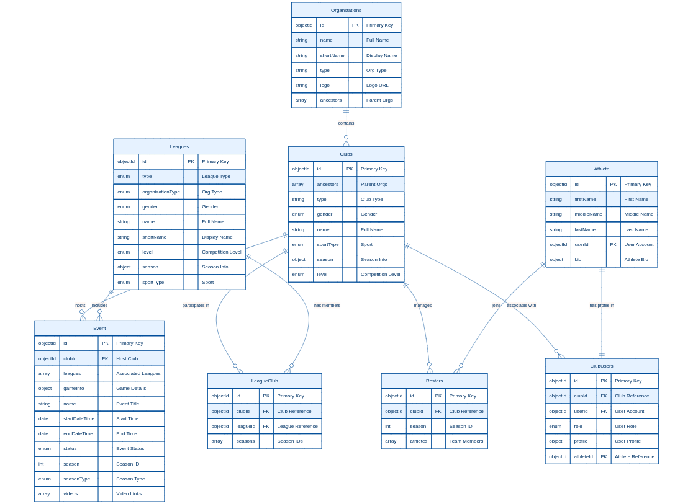

# Entity Relations - Data Model Overview

## Data Model Diagram

*The diagram above illustrates the relationships between entities in our data model.*

## Introduction

This page provides a comprehensive overview of the data model for integration partners. It details the core entities, their attributes, and the relationships between them, serving as a reference for API integration and data exchange implementations.

## Core Entities

### Organizations

Organizations serve as parent entities that can contain multiple clubs across different sports, levels, and demographics.

**Attributes:**
- `_id` (Primary Key): Unique object identifier
- `name`: Complete organizational name
- `shortName`: Abbreviated name for display purposes
- `type`: Organization type string
- `logo`: URL or reference to logo image
- `ancestors` (Array): Array of parent organization object IDs

### Clubs (Teams)

Clubs represent specific sporting groups that compete in events and leagues. Clubs may exist independently or be associated with an organization.

**Attributes:**
- `_id` (Primary Key): Unique object identifier
- `name`: Full club name
- `type`: Club type string
- `gender`: Gender enumeration
- `sportType`: Type of sport the club plays (enumeration)
- `level`: Competition level enumeration (applicable for High Schools)
- `ancestors` (Array): Array of parent organization object IDs
- `season`: Nested object containing:
  - `format`: Season format enumeration
  - `startDate`: Season start date string
  - `endDate`: Season end date string

### Leagues

Leagues represent competition structures that include multiple clubs across one or more seasons.

**Attributes:**
- `_id` (Primary Key): Unique object identifier
- `name`: Complete league name
- `shortName`: Abbreviated name for display purposes
- `type`: League type enumeration (Association, Tournament)
- `organizationType`: Organization type enumeration
- `sportType`: Sport type enumeration
- `gender`: Gender enumeration
- `level`: Competition level enumeration
- `season`: Nested object containing:
  - `format`: Season format enumeration
  - `startDate`: Season start date string
  - `endDate`: Season end date string

### LeagueClub

Junction entity associating clubs with leagues, allowing clubs to participate in multiple leagues and leagues to include multiple clubs.

**Attributes:**
- `_id` (Primary Key): Unique object identifier
- `clubId`: Reference to the associated club
- `leagueId`: Reference to the associated league
- `seasons` (Array): Array of season identifiers (integers)

### Rosters

Represents a collection of athletes associated with a specific club for a specific season.

**Attributes:**
- `_id` (Primary Key): Unique object identifier
- `clubId`: Reference to the associated club
- `season`: Season identifier (integer)
- `athletes` (Array): Array of athlete objects containing:
  - `status`: Status enumeration
  - `jersey`: Jersey number (integer)
  - `positions` (Array): Array of position enumerations
  - `athleteId`: Reference to the athlete profile

### Athlete

Contains persistent information about athletes that remains consistent across all club associations.

**Attributes:**
- `_id` (Primary Key): Unique object identifier
- `firstName`: Athlete's first name
- `middleName`: Athlete's middle name
- `lastName`: Athlete's last name
- `userId`: Reference to user authentication account
- `bio`: Nested object containing:
  - `birthdate`: Date of birth
  - `country`: Country of origin
  - `state`: State or province
  - `city`: City
  - `nationality`: Athlete's nationality
  - `height`: Nested object with:
    - `value`: Height value (double)
    - `metric`: Measurement unit (string)
  - `weight`: Nested object with:
    - `value`: Weight value (double)
    - `metric`: Measurement unit (string)
  - `hand`: Handedness enumeration
  - `class`: School class (string)
  - `graduationYear`: Expected graduation year (integer)

### ClubUsers

Junction entity associating users with clubs, including athletes and non-athlete staff.

**Attributes:**
- `_id` (Primary Key): Unique object identifier
- `clubId`: Reference to the associated club
- `userId`: Reference to user authentication account
- `role`: User role enumeration
- `athleteId`: Optional reference to athlete profile if the user is an athlete
- `profile`: Nested object containing:
  - `email`: User's email address
  - `firstName`: User's first name
  - `middleName`: User's middle name
  - `lastName`: User's last name

### Event

Represents a specific sporting competition between teams.

**Attributes:**
- `_id` (Primary Key): Unique object identifier
- `clubId`: Club that created the event
- `leagues` (Array): Array of league object IDs associated with the event
- `name`: Event name or title
- `startDateTime`: Scheduled start date and time
- `endDateTime`: Scheduled end date and time
- `status`: Event status enumeration
- `season`: Season identifier (integer)
- `seasonType`: Season type enumeration
- `videos` (Array): Array of video objects
- `gameInfo`: Nested object containing:
  - `name`: Game name enumeration
  - `gender`: Gender enumeration
  - `type`: Game type enumeration
  - `team1Id`: Reference to home team
  - `team2Id`: Reference to away team (optional)
  - `team1`: Full name of home team
  - `team2`: Full name of away team (optional)
  - `team1Short`: Short name of home team
  - `team2Short`: Short name of away team (optional)
  - `team1Color`: Home team jersey color
  - `team2Color`: Away team jersey color (optional)
  - `team1Logo`: URL or reference to home team logo
  - `team2Logo`: URL or reference to away team logo (optional)
  - `score1`: Home team score (integer)
  - `score2`: Away team score (integer)
  - `lineup` (Array): Array of lineup objects containing:
    - `name`: Player name
    - `jersey`: Jersey number (string)
    - `fake`: Boolean indicating placeholder player
    - `teamId`: Team identifier
    - `played`: Boolean indicating participation
    - `started`: Boolean indicating starter status
    - `athleteId`: Reference to athlete profile

## Relationships

### Organizational Hierarchy
- Organizations can be hierarchical (with ancestors)
- Organizations can contain multiple clubs
- Clubs may be independent or associated with organizations

### Club Participation
- Clubs can have multiple seasons
- Clubs can participate in multiple leagues across different seasons
- Clubs create and participate in events
- Clubs maintain rosters of athletes

### Athlete Management
- Each athlete has one global profile
- Athletes can be associated with multiple clubs through roster entries
- Athletes can appear in event lineups
- Athletes can have user accounts through ClubUsers

### League Structure
- Leagues manage multiple seasons
- Leagues include multiple clubs through LeagueClub junctions
- Events can be associated with multiple leagues

### Event Organization
- Events are created by clubs
- Events involve home and away teams
- Events can be associated with leagues
- Events include lineup information for participating players

## Integration Considerations

### API Access Patterns
1. **Organization-centric**: Retrieving all clubs under an organization
2. **Club-centric**: Accessing roster, season, and event information for specific clubs
3. **Athlete-centric**: Tracking an athlete's participation across clubs and events
4. **Event-centric**: Retrieving event details including lineups and league associations
5. **League-centric**: Accessing clubs and events associated with leagues

### Data Synchronization
When synchronizing data between systems, consider the following dependencies:
1. Organizations must exist before associated clubs
2. Clubs must exist before associated rosters and events
3. Leagues must exist before league-club associations
4. Athletes must have profiles before roster associations
5. Events require participating clubs before lineups can be created

### Temporal Considerations
The platform maintains several types of temporal relationships:
- Club and league seasons represent distinct time periods
- Events occur at specific times and may be associated with seasons
- Roster athletes may join or leave clubs over time
- Lineups represent club composition for specific events

## Conclusion

This document provides a comprehensive overview of the data model. For detailed API specifications, authentication requirements, and implementation examples, please refer to the API documentation provided separately.
